# Application Sequence Diagrams

This document describes the current runtime flows for every inbound adapter in:

- `Src/Orders.Integrations.Hub/Core/Adapters/In`
- `Src/Orders.Integrations.Hub/Core/Adapters/Out`
- `Src/Orders.Integrations.Hub/Integrations/IFood/Adapters/In`
- `Src/Orders.Integrations.Hub/Integrations/Rappi/Adapters/In`
- `Src/Orders.Integrations.Hub/Integrations/Food99/Adapters/In`

The diagrams use Mermaid sequence-diagram syntax. Each integration webhook starts with the shared `WebhookSignatureFilter`; the downstream MassTransit consumers are shown separately because command publication and command consumption are asynchronous boundaries.

## Entrypoint Inventory

| Adapter | Entrypoint | Main flow |
|---|---|---|
| Core HTTP | `GET /orders/cancellation-reasons` | Route by integration, then return integration-specific cancellation reasons |
| Core HTTP | `PATCH /orders/status` | Route by integration, then call the integration status API |
| Core HTTP | `POST /orders/disputes` | Route by integration, then respond to an integration dispute |
| Core HTTP | `POST /orders/products/enable` | Unwrap SNS payload, then resolve product-status use case |
| Core HTTP | `POST /orders/products/disable` | Unwrap SNS payload, then resolve product-status use case |
| Core messaging | `CreateOrderCommand` | Persist an order through `IOrderClient` |
| Core messaging | `UpdateOrderStatusCommand` | Patch order status through `IOrderClient` |
| Core messaging | `ProcessOrderDisputeCommand` | Build an `OrderUpdate`, then patch the dispute through `IOrderClient` |
| Core messaging | `SendNotificationCommand` | Publish a serialized message to SNS |
| IFood HTTP | `POST /ifood/webhook` | Dispatch by `IFoodFullOrderStatus` |
| Rappi HTTP | `POST /rappi/webhook` | Create an order |
| Rappi HTTP | `POST /rappi/webhook/cancel` | Process a cancellation event |
| Rappi HTTP | `POST /rappi/webhook/other` | Process another order event |
| Rappi HTTP | `POST /rappi/webhook/ping` | Return the store health response |
| Food99 HTTP | `POST /food99/webhook` | Dispatch by `Food99Type` |

## Participants And Boundaries

- `Orders Platform` represents an external integration platform or caller.
- `Orders Hub API` represents ASP.NET Core endpoint execution.
- `IIntegrationRouter` resolves keyed use cases using the integration key.
- Integration clients are typed clients such as `IIFoodClient`, `IRappiClient`, and `IFood99Client`.
- `ICommandDispatcher` is implemented by `MassTransitCommandDispatcher`, which calls `IBus.Publish`.
- `OrderClient`, `InternalClient`, and storage clients are outbound adapters. Their concrete HTTP and storage details are shown where they are part of the entrypoint flow.
- `InternalCacheClient` is the cache decorator around `InternalClient`; its concrete cache can be memory-only, Redis, or hybrid according to configuration.

## Shared Webhook Ingress

Every integration webhook uses `WebhookSignatureFilter<TRequest, TValidator, TResolver>` before the endpoint delegate. The filter reads and deserializes the raw request body, resolves the integration context, validates the signature, and only then calls the endpoint.

### Shared Signature Filter

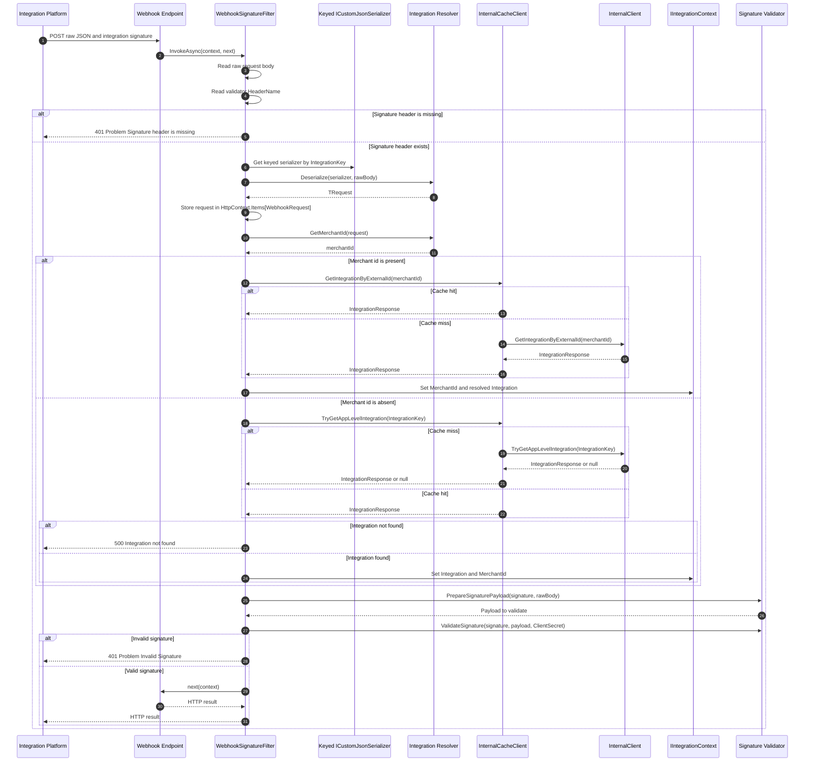

| Integration | Signature header | Keyed serializer |
|---|---|---|
| IFood | `X-IFood-Signature` | `ifood_` |
| Rappi | `Rappi-Signature` | `rappi_` |
| Food99 | `didi-header-sign` | `99food_` |

## Core Messaging Entrypoints

These consumers are the asynchronous continuation of the integration create, update, and dispute webhook flows. The consumer receives a MassTransit message and calls the Orders service through `IOrderClient`.

### CreateOrderCommand

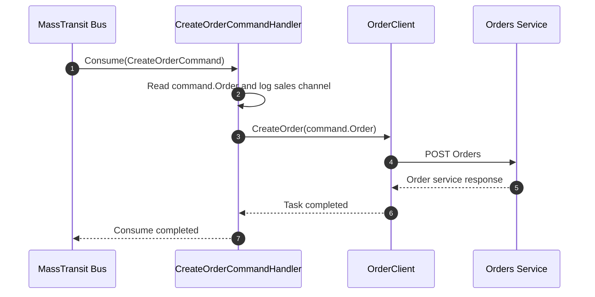

### UpdateOrderStatusCommand

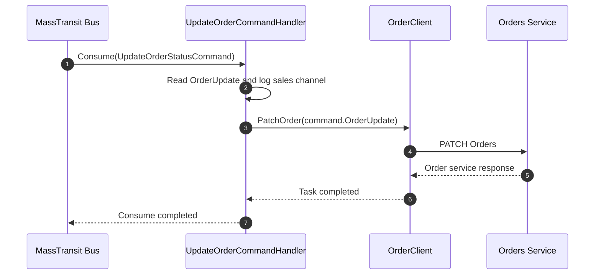

### ProcessOrderDisputeCommand

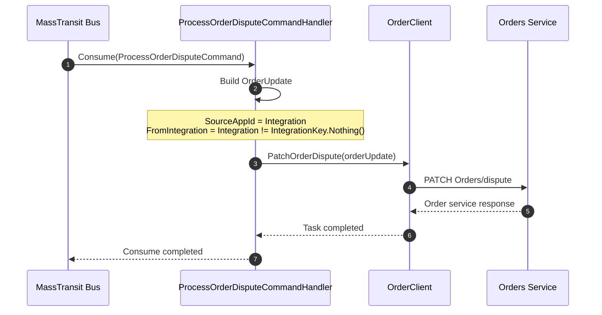

### SendNotificationCommand

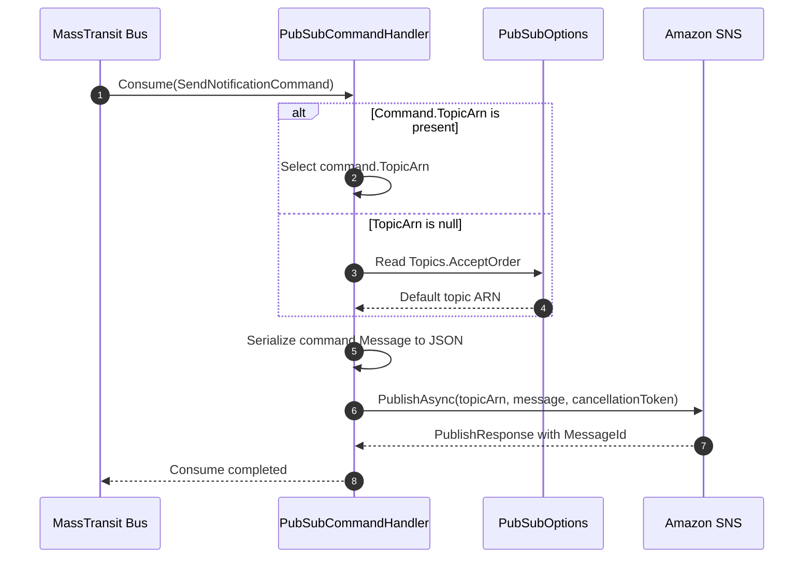

## Core HTTP Entrypoints

The core endpoints resolve integration-specific ports through keyed dependency injection. An unknown key causes `IntegrationRouter.Resolve` to throw `UnknownIntegrationException`; the application error middleware returns the corresponding problem response.

### GET `/orders/cancellation-reasons` - IFood

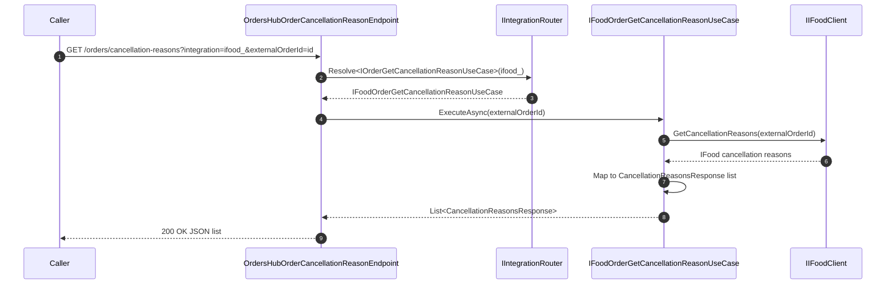

### GET `/orders/cancellation-reasons` - Rappi

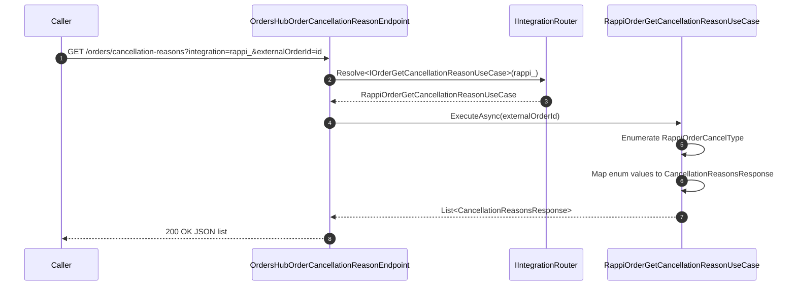

### GET `/orders/cancellation-reasons` - Food99

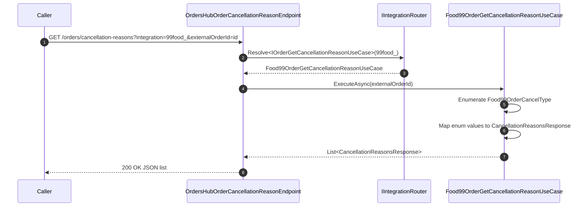

### GET `/orders/cancellation-reasons` - Unknown integration

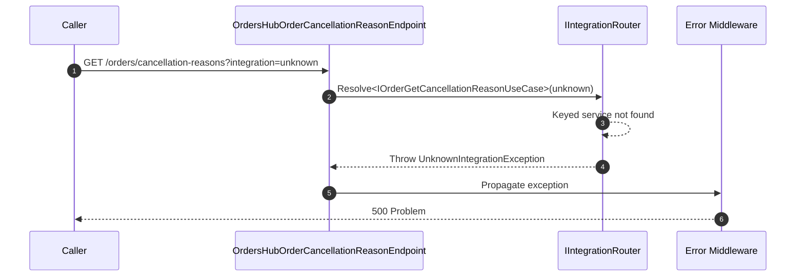

### PATCH `/orders/status` - IFood

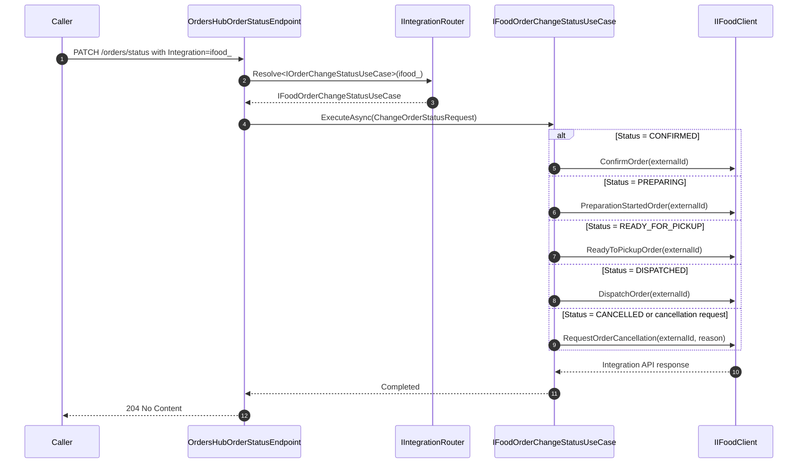

### PATCH `/orders/status` - Rappi

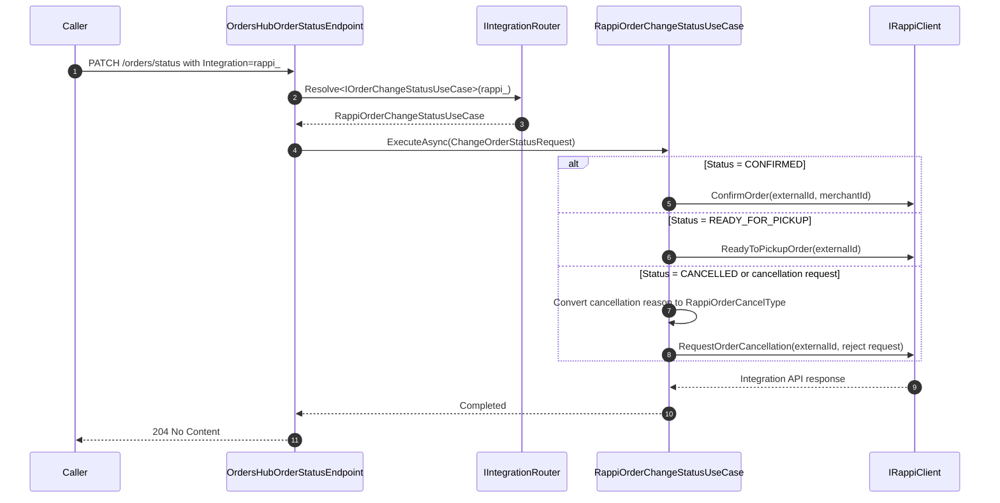

### PATCH `/orders/status` - Food99

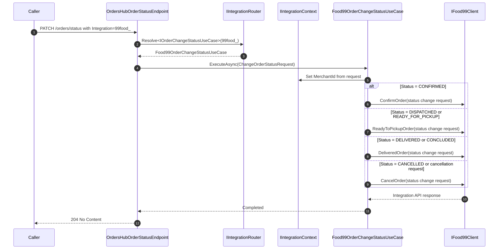

### PATCH `/orders/status` - Unknown integration

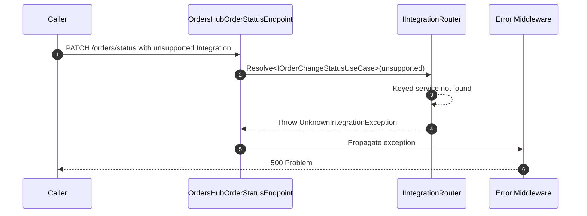

### POST `/orders/disputes` - IFood

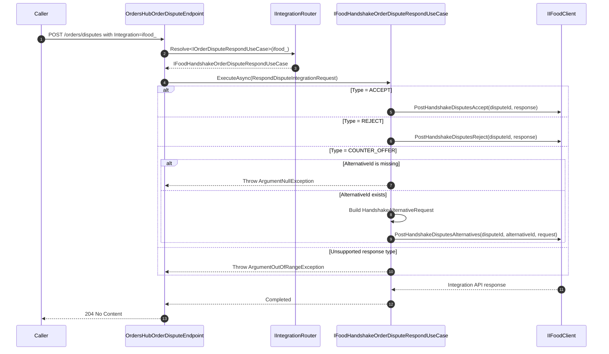

### POST `/orders/disputes` - Unsupported integration

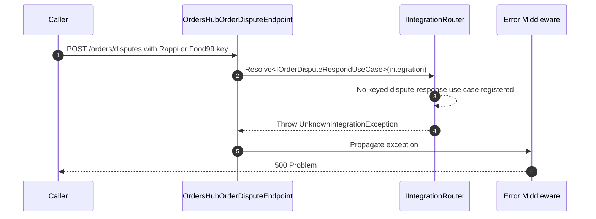

### POST `/orders/products/enable` and `/disable` - Current resolution

Both product routes use the same endpoint implementation. The endpoint reads an SNS envelope and then resolves a product-status use case with `IntegrationKey.Nothing()`, whose value is the empty string. Current DI registrations use `ifood_` and `rappi_`; there is no product-status use case registered for the empty key.

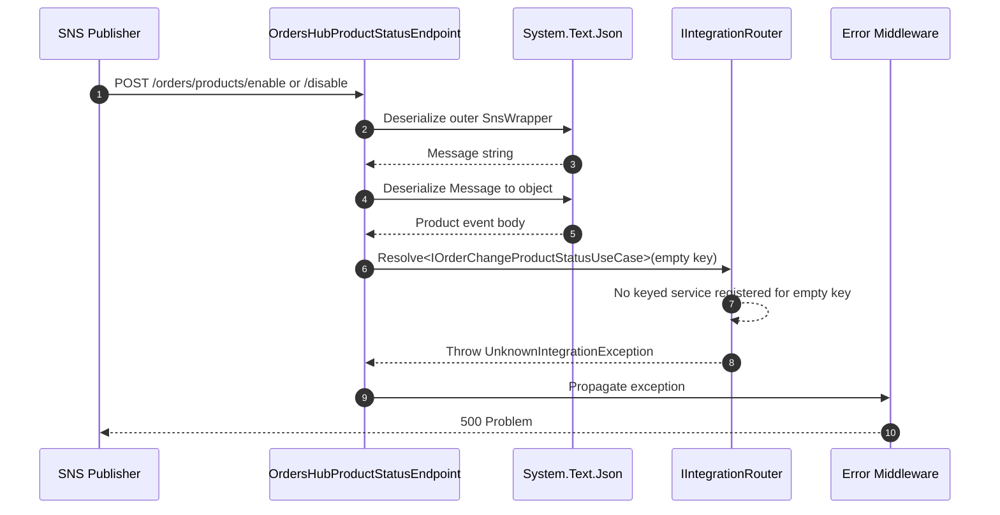

### Product-status implementation - IFood design path

This is the registered `IFoodOrderChangeProductStatusUseCase` path, but it is not reachable from the current core endpoint because that endpoint resolves the empty key. The current implementation also contains empty SKU and merchant collections, so the loop performs no client calls.

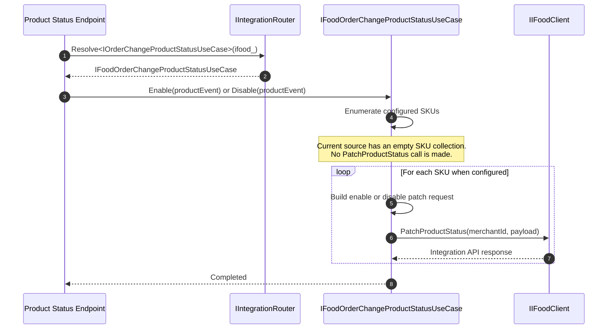

### Product-status implementation - Rappi design path

This is the registered `RappiOrderChangeProductStatusUseCase` path, but it is not reachable from the current core endpoint because that endpoint resolves the empty key. The current implementation has an empty store collection and throws before making client calls.

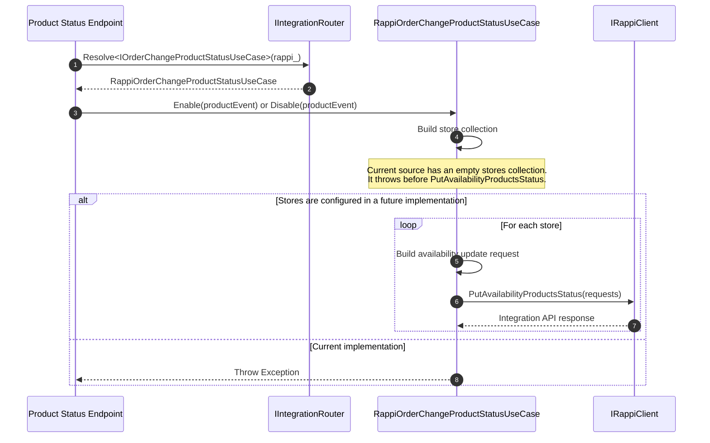

## IFood Webhook Entrypoints

All diagrams in this section start after the shared signature filter has accepted the request. The filter uses `IFoodSignatureStrategy`, the keyed `CommonJsonSerializer`, and IFood request-resolver behavior supplied by the integration infrastructure.

### IFood dispatch map

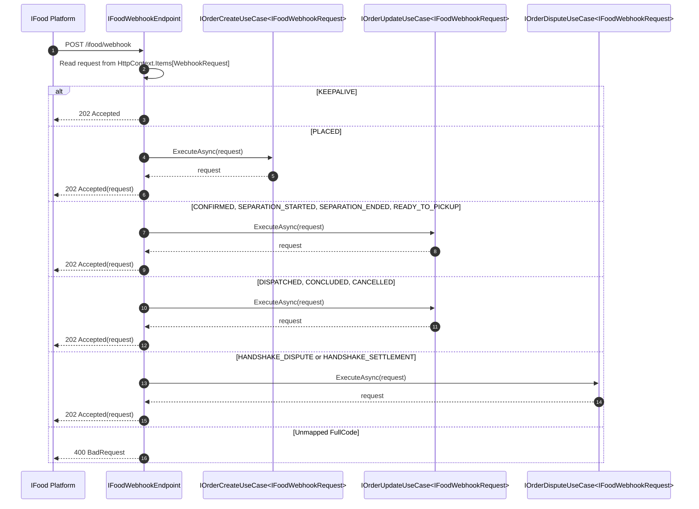

### IFood `KEEPALIVE`

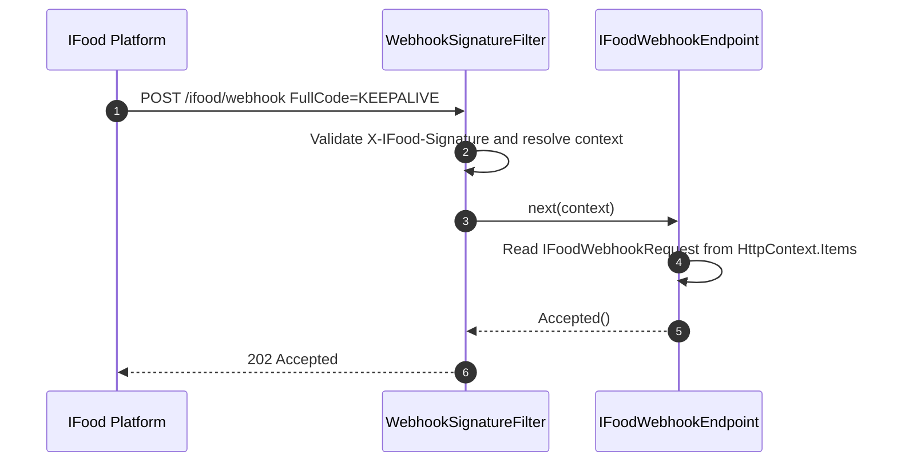

### IFood `PLACED`

```mermaid
sequenceDiagram
    autonumber
    participant IFood as IFood Platform
    participant Filter as WebhookSignatureFilter
    participant Endpoint as IFoodWebhookEndpoint
    participant CreateUseCase as IFoodOrderCreateUseCase
    participant IFoodClient as IIFoodClient
    participant Context as IIntegrationContext
    participant Dispatcher as ICommandDispatcher
    participant Bus as MassTransit Bus

    IFood->>Filter: POST /ifood/webhook FullCode=PLACED
    Filter->>Filter: Deserialize and validate signature
    Filter->>Endpoint: next(context)
    Endpoint->>CreateUseCase: ExecuteAsync(request)
    CreateUseCase->>IFoodClient: GetOrderDetails(request.OrderId)
    IFoodClient-->>CreateUseCase: IFoodOrder
    CreateUseCase->>Context: Read Integration.TenantId
    CreateUseCase->>CreateUseCase: Map IFoodOrder to core Order
    CreateUseCase->>Dispatcher: DispatchAsync(CreateOrderCommand)
    Dispatcher->>Bus: Publish(CreateOrderCommand)
    Bus-->>Dispatcher: Published
    opt Integration.AutoAccept is true
        CreateUseCase->>CreateUseCase: Build CONFIRMED notification
        CreateUseCase->>Dispatcher: DispatchAsync(SendNotificationCommand)
        Dispatcher->>Bus: Publish(SendNotificationCommand)
        Bus-->>Dispatcher: Published
    end
    Dispatcher-->>CreateUseCase: Completed
    CreateUseCase-->>Endpoint: request
    Endpoint-->>Filter: Accepted(request)
    Filter-->>IFood: 202 Accepted
    Note over Bus: CreateOrderCommand and SendNotificationCommand are consumed asynchronously.<br/>See Core Messaging Entrypoints.
```

### IFood `CONFIRMED`

```mermaid
sequenceDiagram
    autonumber
    participant IFood as IFood Platform
    participant Filter as WebhookSignatureFilter
    participant Endpoint as IFoodWebhookEndpoint
    participant Update as IFoodOrderUpdateUseCase
    participant Dispatcher as ICommandDispatcher
    participant Bus as MassTransit Bus

    IFood->>Filter: POST /ifood/webhook FullCode=CONFIRMED
    Filter->>Filter: Deserialize and validate signature
    Filter->>Endpoint: next(context)
    Endpoint->>Update: ExecuteAsync(request)
    Update->>Update: Map FromIFood to OrderUpdate
    Update->>Dispatcher: DispatchAsync(UpdateOrderStatusCommand, SalesChannel=ifood_)
    Dispatcher->>Bus: Publish(UpdateOrderStatusCommand)
    Bus-->>Dispatcher: Published
    Dispatcher-->>Update: Completed
    Update-->>Endpoint: request
    Endpoint-->>Filter: Accepted(request)
    Filter-->>IFood: 202 Accepted
```

### IFood `SEPARATION_STARTED`

```mermaid
sequenceDiagram
    autonumber
    participant IFood as IFood Platform
    participant Filter as WebhookSignatureFilter
    participant Endpoint as IFoodWebhookEndpoint
    participant Update as IFoodOrderUpdateUseCase
    participant Dispatcher as ICommandDispatcher
    participant Bus as MassTransit Bus

    IFood->>Filter: POST /ifood/webhook FullCode=SEPARATION_STARTED
    Filter->>Filter: Deserialize and validate signature
    Filter->>Endpoint: next(context)
    Endpoint->>Update: ExecuteAsync(request)
    Update->>Update: Map FromIFood to OrderUpdate
    Update->>Dispatcher: DispatchAsync(UpdateOrderStatusCommand, SalesChannel=ifood_)
    Dispatcher->>Bus: Publish(UpdateOrderStatusCommand)
    Bus-->>Dispatcher: Published
    Update-->>Endpoint: request
    Endpoint-->>Filter: Accepted(request)
    Filter-->>IFood: 202 Accepted
```

### IFood `SEPARATION_ENDED`

```mermaid
sequenceDiagram
    autonumber
    participant IFood as IFood Platform
    participant Filter as WebhookSignatureFilter
    participant Endpoint as IFoodWebhookEndpoint
    participant Update as IFoodOrderUpdateUseCase
    participant Dispatcher as ICommandDispatcher
    participant Bus as MassTransit Bus

    IFood->>Filter: POST /ifood/webhook FullCode=SEPARATION_ENDED
    Filter->>Filter: Deserialize and validate signature
    Filter->>Endpoint: next(context)
    Endpoint->>Update: ExecuteAsync(request)
    Update->>Update: Map FromIFood to OrderUpdate
    Update->>Dispatcher: DispatchAsync(UpdateOrderStatusCommand, SalesChannel=ifood_)
    Dispatcher->>Bus: Publish(UpdateOrderStatusCommand)
    Bus-->>Dispatcher: Published
    Update-->>Endpoint: request
    Endpoint-->>Filter: Accepted(request)
    Filter-->>IFood: 202 Accepted
```

### IFood `READY_TO_PICKUP`

```mermaid
sequenceDiagram
    autonumber
    participant IFood as IFood Platform
    participant Filter as WebhookSignatureFilter
    participant Endpoint as IFoodWebhookEndpoint
    participant Update as IFoodOrderUpdateUseCase
    participant Dispatcher as ICommandDispatcher
    participant Bus as MassTransit Bus

    IFood->>Filter: POST /ifood/webhook FullCode=READY_TO_PICKUP
    Filter->>Filter: Deserialize and validate signature
    Filter->>Endpoint: next(context)
    Endpoint->>Update: ExecuteAsync(request)
    Update->>Update: Map FromIFood to OrderUpdate
    Update->>Dispatcher: DispatchAsync(UpdateOrderStatusCommand, SalesChannel=ifood_)
    Dispatcher->>Bus: Publish(UpdateOrderStatusCommand)
    Bus-->>Dispatcher: Published
    Update-->>Endpoint: request
    Endpoint-->>Filter: Accepted(request)
    Filter-->>IFood: 202 Accepted
```

### IFood `DISPATCHED`

```mermaid
sequenceDiagram
    autonumber
    participant IFood as IFood Platform
    participant Filter as WebhookSignatureFilter
    participant Endpoint as IFoodWebhookEndpoint
    participant Update as IFoodOrderUpdateUseCase
    participant Dispatcher as ICommandDispatcher
    participant Bus as MassTransit Bus

    IFood->>Filter: POST /ifood/webhook FullCode=DISPATCHED
    Filter->>Filter: Deserialize and validate signature
    Filter->>Endpoint: next(context)
    Endpoint->>Update: ExecuteAsync(request)
    Update->>Update: Map FromIFood to OrderUpdate
    Update->>Dispatcher: DispatchAsync(UpdateOrderStatusCommand, SalesChannel=ifood_)
    Dispatcher->>Bus: Publish(UpdateOrderStatusCommand)
    Bus-->>Dispatcher: Published
    Update-->>Endpoint: request
    Endpoint-->>Filter: Accepted(request)
    Filter-->>IFood: 202 Accepted
```

### IFood `CONCLUDED`

```mermaid
sequenceDiagram
    autonumber
    participant IFood as IFood Platform
    participant Filter as WebhookSignatureFilter
    participant Endpoint as IFoodWebhookEndpoint
    participant Update as IFoodOrderUpdateUseCase
    participant Dispatcher as ICommandDispatcher
    participant Bus as MassTransit Bus

    IFood->>Filter: POST /ifood/webhook FullCode=CONCLUDED
    Filter->>Filter: Deserialize and validate signature
    Filter->>Endpoint: next(context)
    Endpoint->>Update: ExecuteAsync(request)
    Update->>Update: Map FromIFood to OrderUpdate
    Update->>Dispatcher: DispatchAsync(UpdateOrderStatusCommand, SalesChannel=ifood_)
    Dispatcher->>Bus: Publish(UpdateOrderStatusCommand)
    Bus-->>Dispatcher: Published
    Update-->>Endpoint: request
    Endpoint-->>Filter: Accepted(request)
    Filter-->>IFood: 202 Accepted
```

### IFood `CANCELLED`

```mermaid
sequenceDiagram
    autonumber
    participant IFood as IFood Platform
    participant Filter as WebhookSignatureFilter
    participant Endpoint as IFoodWebhookEndpoint
    participant Update as IFoodOrderUpdateUseCase
    participant Dispatcher as ICommandDispatcher
    participant Bus as MassTransit Bus

    IFood->>Filter: POST /ifood/webhook FullCode=CANCELLED
    Filter->>Filter: Deserialize and validate signature
    Filter->>Endpoint: next(context)
    Endpoint->>Update: ExecuteAsync(request)
    Update->>Update: Map FromIFood to OrderUpdate
    Update->>Dispatcher: DispatchAsync(UpdateOrderStatusCommand, SalesChannel=ifood_)
    Dispatcher->>Bus: Publish(UpdateOrderStatusCommand)
    Bus-->>Dispatcher: Published
    Update-->>Endpoint: request
    Endpoint-->>Filter: Accepted(request)
    Filter-->>IFood: 202 Accepted
```

### IFood `HANDSHAKE_DISPUTE`

```mermaid
sequenceDiagram
    autonumber
    participant IFood as IFood Platform
    participant Filter as WebhookSignatureFilter
    participant Endpoint as IFoodWebhookEndpoint
    participant Dispute as IFoodHandshakeOrderDisputeUseCase
    participant Serializer as ICustomJsonSerializer
    participant Storage as IFoodDisputeEvidenceStorage
    participant Evidence as Evidence URL
    participant S3 as IObjectStorageClient
    participant Dispatcher as ICommandDispatcher
    participant Bus as MassTransit Bus

    IFood->>Filter: POST /ifood/webhook FullCode=HANDSHAKE_DISPUTE
    Filter->>Filter: Deserialize and validate signature
    Filter->>Endpoint: next(context)
    Endpoint->>Dispute: ExecuteAsync(request)
    Dispute->>Serializer: Serialize request.Metadata
    Serializer-->>Dispute: Metadata JSON
    Dispute->>Serializer: Deserialize HandshakeDispute
    Serializer-->>Dispute: HandshakeDispute
    alt Evidence list is present
        Dispute->>Storage: MigrateEvidencesToStorage(orderId, disputeId, evidences)
        loop For each evidence
            Storage->>Evidence: GET evidence.Url
            Evidence-->>Storage: Evidence bytes and content type
            Storage->>S3: UploadFile(stream, contentType, keyPath)
            S3-->>Storage: Stored key
            Storage->>S3: GetTemporaryUrl(storedKey)
            S3-->>Storage: Temporary URL
        end
        Storage-->>Dispute: Evidence references with stored URLs
    end
    Dispute->>Dispute: Map dispute to core OrderDispute
    Dispute->>Dispatcher: DispatchAsync(ProcessOrderDisputeCommand, DISPUTE_STARTED)
    Dispatcher->>Bus: Publish(ProcessOrderDisputeCommand)
    Bus-->>Dispatcher: Published
    Dispute-->>Endpoint: request
    Endpoint-->>Filter: Accepted(request)
    Filter-->>IFood: 202 Accepted
```

### IFood `HANDSHAKE_SETTLEMENT`

```mermaid
sequenceDiagram
    autonumber
    participant IFood as IFood Platform
    participant Filter as WebhookSignatureFilter
    participant Endpoint as IFoodWebhookEndpoint
    participant Dispute as IFoodHandshakeOrderDisputeUseCase
    participant Serializer as ICustomJsonSerializer
    participant Storage as IFoodDisputeEvidenceStorage
    participant S3 as IObjectStorageClient
    participant Dispatcher as ICommandDispatcher
    participant Bus as MassTransit Bus

    IFood->>Filter: POST /ifood/webhook FullCode=HANDSHAKE_SETTLEMENT
    Filter->>Filter: Deserialize and validate signature
    Filter->>Endpoint: next(context)
    Endpoint->>Dispute: ExecuteAsync(request)
    Dispute->>Serializer: Serialize request.Metadata
    Serializer-->>Dispute: Metadata JSON
    Dispute->>Serializer: Deserialize HandshakeSettlement
    Serializer-->>Dispute: HandshakeSettlement
    Dispute->>Storage: DeleteDisputeEvidence(orderId, disputeId)
    Storage->>S3: Delete evidence folder
    S3-->>Storage: Delete completed
    Storage-->>Dispute: Completed
    Dispute->>Dispute: Build settlement OrderDispute with DISPUTE_FINISH
    Dispute->>Dispatcher: DispatchAsync(ProcessOrderDisputeCommand, DISPUTE_FINISH)
    Dispatcher->>Bus: Publish(ProcessOrderDisputeCommand)
    Bus-->>Dispatcher: Published
    Dispute-->>Endpoint: request
    Endpoint-->>Filter: Accepted(request)
    Filter-->>IFood: 202 Accepted
```

### IFood unmapped `FullCode`

```mermaid
sequenceDiagram
    autonumber
    participant IFood as IFood Platform
    participant Filter as WebhookSignatureFilter
    participant Endpoint as IFoodWebhookEndpoint

    IFood->>Filter: POST /ifood/webhook with unsupported FullCode
    Filter->>Filter: Deserialize and validate signature
    Filter->>Endpoint: next(context)
    Endpoint->>Endpoint: Switch has no matching event
    Endpoint-->>Filter: BadRequest(error = not mapped but ok)
    Filter-->>IFood: 400 Bad Request
```

## Rappi Webhook Entrypoints

### Rappi order creation - `POST /rappi/webhook`

```mermaid
sequenceDiagram
    autonumber
    participant Rappi as Rappi Platform
    participant Filter as WebhookSignatureFilter
    participant Endpoint as RappiWebhookCreateOrderEndpoint
    participant CreateUseCase as RappiOrderCreateUseCase
    participant Context as IIntegrationContext
    participant Dispatcher as ICommandDispatcher
    participant Bus as MassTransit Bus

    Rappi->>Filter: POST /rappi/webhook order payload
    Filter->>Filter: Deserialize with RappiOrderResolver
    Filter->>Filter: Validate Rappi-Signature
    Filter->>Endpoint: next(context)
    Endpoint->>CreateUseCase: ExecuteAsync(WebhookRequest)
    CreateUseCase->>Context: Read Integration.TenantId
    CreateUseCase->>CreateUseCase: Map RappiOrder to core Order
    CreateUseCase->>Dispatcher: DispatchAsync(CreateOrderCommand)
    Dispatcher->>Bus: Publish(CreateOrderCommand)
    Bus-->>Dispatcher: Published
    opt Integration.AutoAccept is true
        CreateUseCase->>CreateUseCase: Build CONFIRMED Rappi notification
        CreateUseCase->>Dispatcher: DispatchAsync(SendNotificationCommand)
        Dispatcher->>Bus: Publish(SendNotificationCommand)
        Bus-->>Dispatcher: Published
    end
    CreateUseCase-->>Endpoint: request
    Endpoint-->>Filter: Created()
    Filter-->>Rappi: 201 Created
```

### Rappi cancellation - `POST /rappi/webhook/cancel`

```mermaid
sequenceDiagram
    autonumber
    participant Rappi as Rappi Platform
    participant Filter as WebhookSignatureFilter
    participant Endpoint as RappiWebhookCancelOrderEndpoint
    participant Update as RappiOrderUpdateUseCase
    participant Dispatcher as ICommandDispatcher
    participant Bus as MassTransit Bus

    Rappi->>Filter: POST /rappi/webhook/cancel event payload
    Filter->>Filter: Deserialize with RappiOrderEventResolver
    Filter->>Filter: Validate Rappi-Signature
    Filter->>Endpoint: next(context)
    Endpoint->>Update: ExecuteAsync(WebhookRequest)
    Update->>Update: Map FromRappi to OrderUpdate
    Update->>Dispatcher: DispatchAsync(UpdateOrderStatusCommand, SalesChannel=rappi_)
    Dispatcher->>Bus: Publish(UpdateOrderStatusCommand)
    Bus-->>Dispatcher: Published
    Update-->>Endpoint: request
    Endpoint-->>Filter: Accepted()
    Filter-->>Rappi: 202 Accepted
```

### Rappi other order event - `POST /rappi/webhook/other`

```mermaid
sequenceDiagram
    autonumber
    participant Rappi as Rappi Platform
    participant Filter as WebhookSignatureFilter
    participant Endpoint as RappiWebhookPatchOrderEndpoint
    participant Update as RappiOrderUpdateUseCase
    participant Dispatcher as ICommandDispatcher
    participant Bus as MassTransit Bus

    Rappi->>Filter: POST /rappi/webhook/other event payload
    Filter->>Filter: Deserialize with RappiOrderEventResolver
    Filter->>Filter: Validate Rappi-Signature
    Filter->>Endpoint: next(context)
    Endpoint->>Update: ExecuteAsync(WebhookRequest)
    Update->>Update: Map FromRappi to OrderUpdate
    Update->>Dispatcher: DispatchAsync(UpdateOrderStatusCommand, SalesChannel=rappi_)
    Dispatcher->>Bus: Publish(UpdateOrderStatusCommand)
    Bus-->>Dispatcher: Published
    Update-->>Endpoint: request
    Endpoint-->>Filter: Accepted()
    Filter-->>Rappi: 202 Accepted
```

### Rappi ping - `POST /rappi/webhook/ping`

```mermaid
sequenceDiagram
    autonumber
    participant Rappi as Rappi Platform
    participant Filter as WebhookSignatureFilter
    participant Endpoint as RappiWebhookPingEndpoint

    Rappi->>Filter: POST /rappi/webhook/ping ping payload
    Filter->>Filter: Deserialize with RappiPingResolver
    Filter->>Filter: Validate Rappi-Signature
    Filter->>Endpoint: next(context)
    Endpoint->>Endpoint: Read RappiWebhookPingRequest from HttpContext.Items
    Endpoint-->>Filter: Ok(Status=Ok, Description=Store on)
    Filter-->>Rappi: 200 OK ping response
    Note over Endpoint: No use case or external client is called.<br/>The source contains a TODO for a future store-status check.
```

## Food99 Webhook Entrypoints

### Food99 dispatch map

```mermaid
sequenceDiagram
    autonumber
    participant Food99 as Food99 Platform
    participant Filter as WebhookSignatureFilter
    participant Endpoint as Food99WebhookEndpoint
    participant CreateUseCase as Food99OrderCreateUseCase
    participant Update as Food99OrderUpdateUseCase
    participant Dispute as Food99ApplyOrderDisputeUseCase

    Food99->>Filter: POST /food99/webhook payload
    Filter->>Filter: Deserialize and validate didi-header-sign
    Filter->>Endpoint: next(context)
    Endpoint->>Endpoint: Read Food99WebhookRequest from HttpContext.Items
    alt Type = OrderNew
        Endpoint->>CreateUseCase: ExecuteAsync(request)
        CreateUseCase-->>Endpoint: request
        Endpoint-->>Filter: Food99BaseResponse errno=0
    else Type = DeliveryStatus, OrderCancel, OrderPartialCancel, or OrderFinish
        Endpoint->>Update: ExecuteAsync(request)
        Update-->>Endpoint: request
        Endpoint-->>Filter: Food99BaseResponse errno=0
    else Type = OrderCancelApply or OrderRefundApply
        Endpoint->>Dispute: ExecuteAsync(request)
        Dispute-->>Endpoint: request
        Endpoint-->>Filter: Food99BaseResponse errno=0
    else Unsupported Type
        Endpoint-->>Filter: Food99BaseResponse errno=1
    end
    Filter-->>Food99: HTTP response
```

### Food99 `OrderNew`

```mermaid
sequenceDiagram
    autonumber
    participant Food99 as Food99 Platform
    participant Filter as WebhookSignatureFilter
    participant Endpoint as Food99WebhookEndpoint
    participant CreateUseCase as Food99OrderCreateUseCase
    participant Context as IIntegrationContext
    participant Dispatcher as ICommandDispatcher
    participant Bus as MassTransit Bus

    Food99->>Filter: POST /food99/webhook Type=OrderNew
    Filter->>Filter: Deserialize and validate didi-header-sign
    Filter->>Endpoint: next(context)
    Endpoint->>CreateUseCase: ExecuteAsync(request)
    CreateUseCase->>Context: Read Integration.TenantId
    CreateUseCase->>CreateUseCase: Map request to core Order
    CreateUseCase->>Dispatcher: DispatchAsync(CreateOrderCommand)
    Dispatcher->>Bus: Publish(CreateOrderCommand)
    Bus-->>Dispatcher: Published
    opt Integration.AutoAccept is true
        CreateUseCase->>CreateUseCase: Build CONFIRMED Food99 notification
        CreateUseCase->>Dispatcher: DispatchAsync(SendNotificationCommand)
        Dispatcher->>Bus: Publish(SendNotificationCommand)
        Bus-->>Dispatcher: Published
    end
    CreateUseCase-->>Endpoint: request
    Endpoint-->>Filter: Food99BaseResponse errno=0, errmsg=ok
    Filter-->>Food99: 200 OK
```

### Food99 `DeliveryStatus`

```mermaid
sequenceDiagram
    autonumber
    participant Food99 as Food99 Platform
    participant Filter as WebhookSignatureFilter
    participant Endpoint as Food99WebhookEndpoint
    participant Update as Food99OrderUpdateUseCase
    participant Dispatcher as ICommandDispatcher
    participant Bus as MassTransit Bus

    Food99->>Filter: POST /food99/webhook Type=DeliveryStatus
    Filter->>Filter: Deserialize and validate didi-header-sign
    Filter->>Endpoint: next(context)
    Endpoint->>Update: ExecuteAsync(request)
    Update->>Update: Map FromFood99 to OrderUpdate
    Update->>Dispatcher: DispatchAsync(UpdateOrderStatusCommand, SalesChannel=99food_)
    Dispatcher->>Bus: Publish(UpdateOrderStatusCommand)
    Bus-->>Dispatcher: Published
    Update-->>Endpoint: request
    Endpoint-->>Filter: Food99BaseResponse errno=0, errmsg=ok
    Filter-->>Food99: 200 OK
```

### Food99 `OrderCancel`

```mermaid
sequenceDiagram
    autonumber
    participant Food99 as Food99 Platform
    participant Filter as WebhookSignatureFilter
    participant Endpoint as Food99WebhookEndpoint
    participant Update as Food99OrderUpdateUseCase
    participant Dispatcher as ICommandDispatcher
    participant Bus as MassTransit Bus

    Food99->>Filter: POST /food99/webhook Type=OrderCancel
    Filter->>Filter: Deserialize and validate didi-header-sign
    Filter->>Endpoint: next(context)
    Endpoint->>Update: ExecuteAsync(request)
    Update->>Update: Map FromFood99 to OrderUpdate
    Update->>Dispatcher: DispatchAsync(UpdateOrderStatusCommand, SalesChannel=99food_)
    Dispatcher->>Bus: Publish(UpdateOrderStatusCommand)
    Bus-->>Dispatcher: Published
    Update-->>Endpoint: request
    Endpoint-->>Filter: Food99BaseResponse errno=0, errmsg=ok
    Filter-->>Food99: 200 OK
```

### Food99 `OrderPartialCancel`

```mermaid
sequenceDiagram
    autonumber
    participant Food99 as Food99 Platform
    participant Filter as WebhookSignatureFilter
    participant Endpoint as Food99WebhookEndpoint
    participant Update as Food99OrderUpdateUseCase
    participant Dispatcher as ICommandDispatcher
    participant Bus as MassTransit Bus

    Food99->>Filter: POST /food99/webhook Type=OrderPartialCancel
    Filter->>Filter: Deserialize and validate didi-header-sign
    Filter->>Endpoint: next(context)
    Endpoint->>Update: ExecuteAsync(request)
    Update->>Update: Map FromFood99 to OrderUpdate
    Update->>Dispatcher: DispatchAsync(UpdateOrderStatusCommand, SalesChannel=99food_)
    Dispatcher->>Bus: Publish(UpdateOrderStatusCommand)
    Bus-->>Dispatcher: Published
    Update-->>Endpoint: request
    Endpoint-->>Filter: Food99BaseResponse errno=0, errmsg=ok
    Filter-->>Food99: 200 OK
```

### Food99 `OrderFinish`

```mermaid
sequenceDiagram
    autonumber
    participant Food99 as Food99 Platform
    participant Filter as WebhookSignatureFilter
    participant Endpoint as Food99WebhookEndpoint
    participant Update as Food99OrderUpdateUseCase
    participant Dispatcher as ICommandDispatcher
    participant Bus as MassTransit Bus

    Food99->>Filter: POST /food99/webhook Type=OrderFinish
    Filter->>Filter: Deserialize and validate didi-header-sign
    Filter->>Endpoint: next(context)
    Endpoint->>Update: ExecuteAsync(request)
    Update->>Update: Map FromFood99 to OrderUpdate
    Update->>Dispatcher: DispatchAsync(UpdateOrderStatusCommand, SalesChannel=99food_)
    Dispatcher->>Bus: Publish(UpdateOrderStatusCommand)
    Bus-->>Dispatcher: Published
    Update-->>Endpoint: request
    Endpoint-->>Filter: Food99BaseResponse errno=0, errmsg=ok
    Filter-->>Food99: 200 OK
```

### Food99 `OrderCancelApply`

```mermaid
sequenceDiagram
    autonumber
    participant Food99 as Food99 Platform
    participant Filter as WebhookSignatureFilter
    participant Endpoint as Food99WebhookEndpoint
    participant Dispute as Food99ApplyOrderDisputeUseCase
    participant Dispatcher as ICommandDispatcher
    participant Bus as MassTransit Bus

    Food99->>Filter: POST /food99/webhook Type=OrderCancelApply
    Filter->>Filter: Deserialize and validate didi-header-sign
    Filter->>Endpoint: next(context)
    Endpoint->>Dispute: ExecuteAsync(request)
    Dispute->>Dispute: Map request to OrderDispute
    Dispute->>Dispatcher: DispatchAsync(ProcessOrderDisputeCommand, Integration=99food_, Type=DISPUTE_STARTED)
    Dispatcher->>Bus: Publish(ProcessOrderDisputeCommand)
    Bus-->>Dispatcher: Published
    Dispute-->>Endpoint: request
    Endpoint-->>Filter: Food99BaseResponse errno=0, errmsg=ok
    Filter-->>Food99: 200 OK
```

### Food99 `OrderRefundApply`

```mermaid
sequenceDiagram
    autonumber
    participant Food99 as Food99 Platform
    participant Filter as WebhookSignatureFilter
    participant Endpoint as Food99WebhookEndpoint
    participant Dispute as Food99ApplyOrderDisputeUseCase
    participant Dispatcher as ICommandDispatcher
    participant Bus as MassTransit Bus

    Food99->>Filter: POST /food99/webhook Type=OrderRefundApply
    Filter->>Filter: Deserialize and validate didi-header-sign
    Filter->>Endpoint: next(context)
    Endpoint->>Dispute: ExecuteAsync(request)
    Dispute->>Dispute: Map request to OrderDispute
    Dispute->>Dispatcher: DispatchAsync(ProcessOrderDisputeCommand, Integration=99food_, Type=DISPUTE_STARTED)
    Dispatcher->>Bus: Publish(ProcessOrderDisputeCommand)
    Bus-->>Dispatcher: Published
    Dispute-->>Endpoint: request
    Endpoint-->>Filter: Food99BaseResponse errno=0, errmsg=ok
    Filter-->>Food99: 200 OK
```

### Food99 unsupported type

```mermaid
sequenceDiagram
    autonumber
    participant Food99 as Food99 Platform
    participant Filter as WebhookSignatureFilter
    participant Endpoint as Food99WebhookEndpoint

    Food99->>Filter: POST /food99/webhook unsupported Type
    Filter->>Filter: Deserialize and validate didi-header-sign
    Filter->>Endpoint: next(context)
    Endpoint->>Endpoint: Switch returns null
    Endpoint-->>Filter: Food99BaseResponse errno=1, errmsg=Could not detect webhook request
    Filter-->>Food99: 400 Bad Request
```

## Generic New Integration Template

The following diagrams are implementation templates for a new isolated integration module. Replace `NewIntegration` with the integration name and register every keyed port that the integration supports.

### Generic inbound webhook

```mermaid
sequenceDiagram
    autonumber
    participant External as NewIntegration Platform
    participant Endpoint as NewIntegrationWebhookEndpoint
    participant Filter as WebhookSignatureFilter<TRequest, TValidator, TResolver>
    participant Serializer as Keyed ICustomJsonSerializer
    participant Internal as InternalClient
    participant Context as IIntegrationContext
    participant UseCase as NewIntegration Use Case
    participant Dispatcher as ICommandDispatcher
    participant Bus as MassTransit Bus

    External->>Endpoint: POST integration webhook
    Endpoint->>Filter: Invoke endpoint filter
    Filter->>Filter: Read raw body and signature header
    Filter->>Serializer: Deserialize with keyed serializer
    Serializer-->>Filter: TRequest
    Filter->>Filter: Resolve merchant id
    Filter->>Internal: GetIntegrationByExternalId or TryGetAppLevelIntegration
    Internal-->>Filter: IntegrationResponse with ClientSecret
    Filter->>Context: Set Integration and MerchantId
    Filter->>Filter: Validate prepared signature with ClientSecret
    Filter->>Endpoint: next(context)
    Endpoint->>UseCase: ExecuteAsync(request)
    UseCase->>UseCase: Map external request to domain data
    UseCase->>Dispatcher: DispatchAsync(core command)
    Dispatcher->>Bus: Publish(core command)
    Bus-->>Dispatcher: Published
    UseCase-->>Endpoint: Mapped response
    Endpoint-->>External: Integration acknowledgement
```

### Generic core-to-integration outbound request

```mermaid
sequenceDiagram
    autonumber
    participant Caller as Orders Hub Caller
    participant Endpoint as Core HTTP Endpoint
    participant Router as IIntegrationRouter
    participant UseCase as NewIntegration Outbound Use Case
    participant Client as INewIntegrationClient
    participant Auth as Integration Auth Handler
    participant External as NewIntegration API

    Caller->>Endpoint: Core request with Integration=new_integration_
    Endpoint->>Router: Resolve keyed outbound port
    Router-->>Endpoint: NewIntegration outbound use case
    Endpoint->>UseCase: ExecuteAsync(request)
    UseCase->>Client: Call integration-specific client method
    Client->>Auth: Add authentication and required headers
    Auth->>External: HTTP request
    External-->>Auth: HTTP response
    Auth-->>Client: Response or mapped error
    Client-->>UseCase: Completed
    UseCase-->>Endpoint: Completed
    Endpoint-->>Caller: Core response
```

### New integration implementation checklist

| Area | Required implementation |
|---|---|
| Domain | External request/response contracts, entities, enums, and value objects |
| Webhook security | `IWebhookSignatureValidator`, signature strategy, and request resolver |
| Serialization | Keyed `ICustomJsonSerializer` registration |
| Inbound ports | Create, update, and dispute use cases supported by the platform |
| Outbound ports | Status, cancellation reasons, product status, or dispute response ports supported by the platform |
| Messaging | Map webhook data to core commands through `ICommandDispatcher` |
| HTTP client | Typed integration client, auth handler, and integration-specific response mapping |
| Dependency injection | Key every supported port and serializer with the integration key |
| Endpoint | Implement `IEndpoint` and attach `WebhookSignatureFilter<TRequest, TValidator, TResolver>` |
| Tests | Serializer, signature, mapping, webhook dispatch, and outbound contract tests |

## Source Map

| Flow | Source |
|---|---|
| Core HTTP endpoints | `Src/Orders.Integrations.Hub/Core/Adapters/In/Http` |
| Core MassTransit consumers | `Src/Orders.Integrations.Hub/Core/Adapters/In/Messaging/EventHandlers` |
| Core outbound HTTP clients | `Src/Orders.Integrations.Hub/Core/Adapters/Out/HttpClients` |
| Shared webhook filter | `Src/Orders.Integrations.Hub/Integrations/Common/Middleware/WebhookSignatureFilter.cs` |
| IFood endpoint and use cases | `Src/Orders.Integrations.Hub/Integrations/IFood/Adapters` and `Application/Ports` |
| Rappi endpoints and use cases | `Src/Orders.Integrations.Hub/Integrations/Rappi/Adapters` and `Application/Ports` |
| Food99 endpoint and use cases | `Src/Orders.Integrations.Hub/Integrations/Food99/Adapters` and `Application/Ports` |
