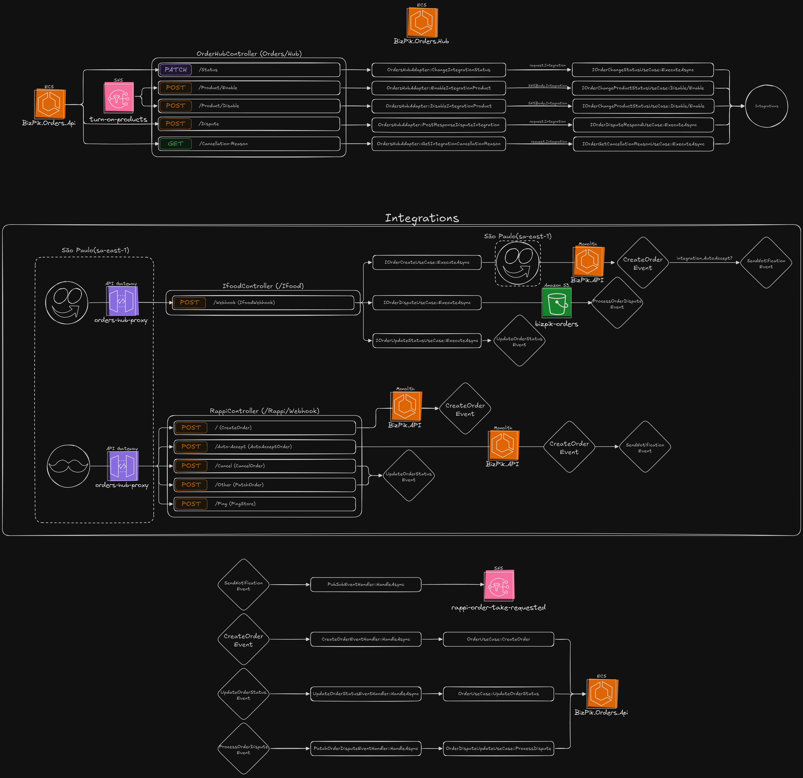

# Integrations Hub for Orders

**`Orders.Integrations.Hub`** is a modular and extensible integration hub built with **.NET 10**, designed to receive and 
standardize external orders from platforms like iFood, Rappi, **99Food**, and more. It forwards these orders to an internal 
system using a clean and decoupled architecture.

## 🔗 Summary

- [🔭 Overview](#-overview)
- [🧩 Architecture Diagram](#-architecture-diagram)
- [📁 Project Structure](#-project-structure)
- [🧱 Integration Architecture](#-integration-architecture)
    - [➕ Adding a New Integration](#-adding-a-new-integration)
    - [🔑 Integration Keys & Routing](#-integration-keys--routing)
    - [🧩 Use Cases Overview](#-use-cases-overview)
    - [🏪 Multi-Tenant Support](#-multi-tenant-support)
    - [🏗 Centralized Credentials Mode](#-centralized-credentials-mode)
    - [🧾 Per-Integration JSON Serialization](#-per-integration-json-serialization)
- [🔄 Communication Flow](#-communication-flow)
- [🧪 Testing](#-testing)
- [🧪 Observability & Monitoring](#-observability--monitoring)
- [🧰 Local Development](#-local-development)
    - [🐳 With Docker Compose](#-with-docker-compose)
    - [☁️ Infrastructure](#-infrastructure)
    - [🔧 Configuration](#-configuration)
- [🔧 Tech Stack](#-tech-stack)
- [🧠 Future Improvements](#-future-improvements)
- [🤝 Contributing](#-contributing)
- [📄 License](#-license)

---

## 🔭 Overview

This project serves as a central entry point for receiving and processing external orders. It provides:

- 🌐 **Minimal APIs**
- 📃 **Scalar** (OpenAPI alternative) for documentation
- 🔄 **Event-driven** internal communication using **FastEndpoints**
- 🔌 **Pluggable integrations** (e.g., Rappi, iFood, **99Food**)
- 🔑 **Type-safe integration routing** with `IntegrationKey` value objects
- 🏪 **Multi-tenant support** (per-merchant credentials via internal API + caching)
- 🧾 **Custom JSON serialization per integration** (no `JsonPropertyName` attributes)
- 📦 **Memory and Distributed Caching**
- 📊 **Observability** with OpenTelemetry
- ☁️ **Infrastructure as Code** with Terraform and LocalStack
- 🧪 **Comprehensive Test Suite**: Unit and Architecture tests

---

## 🧩 Architecture Diagram

> 📌 You can find the diagram in: [`Docs/Architecture.png`](./Docs/Architecture-Light.png)



Key elements:
- Inbound integrations via Webhooks or Pulling
- Each integration (**iFood**, **Rappi**, **99Food**, etc.) has isolated flows
- Events are created and consumed asynchronously
- All inbound calls use the `UseCases.In` contracts to reach internal services (e.g., Orders API)
- All outbound calls use the `UseCases.Out` contracts to reach external services (e.g, Integration API)

---

## 📁 Project Structure

```text
Orders.Integrations.Hub/
├── Src/
│   └── Orders.Integrations.Hub/
│       ├── Core/
│       │   ├── Adapter/        # HTTP endpoints (Minimal APIs)
│       │   ├── Application/    # Middlewares, Extensions, Use Cases
│       │   └── Domain/         # Contracts, Entities, Value Objects
│       │
│       └── Integrations/       # Modular integrations: Ifood, Rappi, 99Food, etc.
│           ├── Common/         # Shared utilities across integrations
│           ├── IFood/          # IFood integration
│           ├── Rappi/          # Rappi integration
│           └── Food99/         # 99Food integration
│
├── Test/
│   ├── Orders.Integrations.Hub.UnitTests/
│   └── Orders.Integrations.Hub.ArchTests/
│
├── Infra/
│   └── terraform/              # Infrastructure code using Terraform
│
├── .env.example                # Example of the necessary environment variables
└── docker-compose.yml          # Local dev environment
```

---

## 🧱 Integration Architecture

Each integration is encapsulated in its own folder and follows its own mini-architecture. This makes it easy to add or 
evolve integrations independently.

### ➕ Adding a New Integration
1. **Create the integration folder** under `Integrations/IntegrationName`.
2. **Define the Integration Key** with validation:
```csharp
   // Integrations/IntegrationName/IntegrationNameIntegrationKey.cs
   [IntegrationKeyDefinition]
   public static class IntegrationNameIntegrationKey 
   {
       public const string Value = "INTEGRATION_NAME";
       
       public static readonly IntegrationKey INTEGRATION_NAME = IntegrationKey.From(Value);
       
       static IntegrationNameIntegrationKey() {
           IntegrationKeyValidator.ValidateRawValue(Value);
       }
   }
```
2. **Implement the architecture** that you prefer (adapters, use cases, clients).
3. **Register dependencies** in `Integrations/IntegrationName/IntegrationNameDependencyInjection.cs`:
```csharp
    public static IServiceCollection AddIntegrationNameIntegration(this IServiceCollection services) {
        
        services.AddKeyedScoped<IOrderChangeStatusUseCase, IntegrationNameOrderChangeStatusUseCase>(IntegrationNameIntegrationKey.Value);
        
        // ...
        
        return services;
    }
```
4. **(Optional)** Provide a custom JSON serializer (see below).
5. **(Optional/Recommended)** Implement the Use Cases for your integration

---

### 🔑 Integration Keys & Routing

The hub uses a type-safe `IntegrationKey` value object instead of enums to achieve extensibility and avoid coupling the
Core domain to specific integrations.

#### **IntegrationKey Value Object**
```csharp
public sealed record IntegrationKey {
    public string Value { get; }
    
    private IntegrationKey(string value) => Value = value;
    
    public static IntegrationKey From(string value) => new(value.Trim().ToUpperInvariant());
}
```

#### **Integration Router**

The `IIntegrationRouter` dynamically resolves use cases based on the integration key at runtime:

**Usage in Controllers:**
```csharp
public static async Task<Ok<List>> GetIntegrationCancellationReason(
    [FromQuery] string? externalOrderId,
    [FromQuery] IntegrationKey integration, // Automatically parsed from query string
    [FromServices] IIntegrationRouter router
) {
    var useCase = router.Resolve<IOrderChangeStatusUseCase>(integration);
    return TypedResults.Ok(await useCase.ExecuteAsync(externalOrderId));
}
```

**HTTP Request Example:**
```http
GET /api/orders/cancellation-reasons?externalOrderId=123&integration=ifood
```
- The `integration` parameter (`"ifood"`) is automatically normalized to `"IFOOD"`
- The router resolves the iFood-specific use case implementation
- Type-safe at compile time, flexible at runtime

#### **Benefits of IntegrationKey**

✅ **Extensible**: Add new integrations without modifying Core domain  
✅ **Type-safe**: Strongly typed with compile-time validation  
✅ **Normalized**: Automatic uppercase normalization prevents DI mismatches  
✅ **Validated**: Runtime validation catches configuration errors at startup

---

### 🧩 Use Cases Overview

⚠️ **Note:** All use cases are optional.  
Implement only the ones supported or required by the partner integration.

| Use Case                            | Direction | When to use                                                                                                |
|-------------------------------------|-----------|------------------------------------------------------------------------------------------------------------|
| `IOrderCreateUseCase`               | IN        | Triggered when a new order is received from the integration and must be sent to the core.                  |
| `IOrderDisputeUseCase`              | IN        | Handles disputes (started/finished) from the integration and forwards them to the core.                    |
| `IOrderUpdateUseCase`               | IN        | Used when an order changes its status in the integration and the core must be updated.                     |
| `IOrderChangeProductStatusUseCase`  | OUT       | Used when the core needs to enable/disable products in the partner system (e.g. stock, catalog).           |
| `IOrderChangeStatusUseCase`         | OUT       | Sends status changes made by the merchant in the core to the integration (e.g. confirm, preparing, cancel).|
| `IOrderDisputeRespondUseCase`       | OUT       | Sends the merchant’s response to a dispute back to the integration.                                        |
| `IOrderGetCancellationReasonUseCase`| OUT       | Retrieves cancellation reasons supported by the integration (via API or enums).                            |

📌 **Summary**
- **IN** → Events coming **from the integration into the Hub** (orders, disputes, updates).
- **OUT** → Events going **from the Hub to the integration** (status changes, catalog updates, disputes, cancellations).

### 🏪 Multi-Tenant Support

Some platforms (like **iFood**, **Rappi**, **99Food**) require **per-merchant credentials** (ClientId, ClientSecret, 
StoreId/MerchantId, etc.).  
This hub supports **multi-tenancy** through a scoped `IntegrationContext`:

- Each HTTP request creates its own **scoped `IntegrationContext`**.
- The context fetches integration metadata (client credentials, merchant/store identifiers, base URLs, etc.) from an **internal API**.
- A **cache decorator** prevents fetching on every request.

**Example (iFood):**
```csharp
integrationContext.Integration = (await internalClient.GetIntegrationByExternalId(request.MerchantId)).ResolveIFood();

integrationContext.MerchantId = request.MerchantId;

string secret = integrationContext.Integration.ClientSecret;
```

This lets the hub adapt dynamically per merchant instead of relying on static environment variables.

---

### 🏗 Centralized Credentials Mode

Not all partners require per-merchant credentials, or you have a centralizer. For those cases, you can **remove the 
`IntegrationContext` dependency** for that integration and bind credentials via environment variables.

**How to switch an integration to centralized mode:**

1. **Remove context usage**: Stop injecting/using `IntegrationContext` in that integration’s handlers/clients.
2. **Bind env vars**: Configure static credentials in `.env` and map them to typed options:
   ```ini
   INTEGRATIONS__PARTNER__CLIENT__ID=your-client-id
   INTEGRATIONS__PARTNER__CLIENT__SECRET=your-client-secret
   INTEGRATIONS__PARTNER__ENDPOINT__BASE_URL=https://api.partner.com
   ```
3. **Register options & client**: Inject the options directly into the integration services (no lookup/caching required).
4. **Validate at startup**: Fail fast if required keys are missing when centralized mode is chosen.

> ✅ Use **multi-tenant** when each merchant has its own credentials.  
> ✅ Use **centralized** when one credential set is shared across all merchants.

---

### 🧾 Per-Integration JSON Serialization

Each integration owns a **custom JSON serializer** (for request/response models), injected via DI using **keyed services**:

Implement the interface `ICustomJsonSerializer` for the integration that you want with all configurations

```csharp
public class RappiJsonSerializer : ICustomJsonSerializer
{
    private static readonly JsonSerializerOptions Options = new() {
        PropertyNamingPolicy = JsonNamingPolicy.SnakeCaseLower,
        DictionaryKeyPolicy = JsonNamingPolicy.SnakeCaseLower,
        PropertyNameCaseInsensitive = true,
        Converters = { new JsonStringEnumConverter(JsonNamingPolicy.SnakeCaseUpper) }
    };

    public string Serialize<T>(T value) => JsonSerializer.Serialize(value, Options);

    public T? Deserialize<T>(string value) => JsonSerializer.Deserialize<T>(value, Options);
}
```

Then in the DI you just need to add the service now with the integration key

```csharp
services.AddKeyedSingleton<ICustomJsonSerializer, RappiJsonSerializer>(RappiIntegrationKey.Value);
```

Now just use it in your integration

```csharp
public IResult Handle(
    [FromKeyedServices(RappiIntegrationKey.Value)] ICustomJsonSerializer jsonSerializer,
    /* other deps */
) {
    // Use the serializer to parse/format payloads for this integration
}
```

This decouples payload shapes per partner and avoids leaking partner-specific casing/naming into shared domain models.

---

## 🔄 Communication Flow

- External platforms (**iFood**, **Rappi**, **99Food**, etc.) send data via webhooks or pulling.
- Requests hit the corresponding endpoint/controller (e.g., `IfoodController`).
- Adapter translates the request into the internal format.
- Use cases send orders via the `UseCases.Out` contracts to the internal Orders system.
- Events are dispatched using `Core.Domain.ValueObjects.Events`.

---

## 🧪 Testing

- ✅ **Unit Tests** for application logic.
- ✅ **Integration Key Validation Tests** to ensure all keys are properly normalized and validated at startup.
- 🧱 **Architecture Tests** using ArchUnit.NET to enforce domain boundaries and modularity.

---

## 🧪 Observability & Monitoring

- **OpenTelemetry**: Tracing, logging, and metrics.
- **Grafana**: Dashboards to visualize telemetry data.
- **Aspire**: Service discovery and metrics aggregation.

---

## 🧰 Local Development

### 🐳 With Docker Compose

```bash
docker-compose up --build -d
```

Includes:
- Orders.Integrations.Hub
- Grafana
- Aspire
- LocalStack (mock Cloud)

### ☁️ Infrastructure

Using Terraform to provision LocalStack:

```bash
cd infra/terraform/envs/local
terraform init
terraform apply
```

Provisioned modules:
- API Gateway
- S3

### 🔧 Configuration

Copy the example env file and fill in the required values:

```bash
cp .env.example .env
```

#### 🔑 Environment Variables Overview

> The exact keys used depend on whether an integration is **multi-tenant** or **centralized**.  
> Multi-tenant integrations fetch credentials from the internal API (and mostly need base URLs).  
> Centralized integrations read credentials directly from env vars + cache keys.

| Category   | Variables (examples)                                                                                                                                                                                |
|------------|-----------------------------------------------------------------------------------------------------------------------------------------------------------------------------------------------------|
| Internal   | `ORDERS__ENDPOINT__BASE_URL` — Internal Orders API endpoint                                                                                                                                         |
| Internal   | `INTERNAL__ENDPOINT__BASE_URL` — Internal API endpoint                                                                                                                                              |
| iFood      | `INTEGRATIONS__IFOOD__ENDPOINT__BASE_URL`, `INTEGRATIONS__IFOOD__CACHE__KEY`, <br>`INTEGRATIONS__IFOOD__CLIENT__ID`, `INTEGRATIONS__IFOOD__CLIENT__SECRET` *(centralized)*                          |
| Rappi      | `INTEGRATIONS__RAPPI__ENDPOINT__BASE_URL`, `INTEGRATIONS__RAPPI__CACHE__KEY`, <br>`INTEGRATIONS__RAPPI__CLIENT__ID`, `INTEGRATIONS__RAPPI__SECRET`, `INTEGRATIONS__RAPPI__AUDIENCE` *(centralized)* |
| 99Food     | `INTEGRATIONS__FOOD99__ENDPOINT__BASE_URL`, `INTEGRATIONS__FOOD99__CACHE__KEY`, <br>`INTEGRATIONS__FOOD99__CLIENT__ID`, `INTEGRATIONS__FOOD99__CLIENT__SECRET` *(centralized)*                      |
| Cache      | `MEMCACHED__ADDRESS`, `MEMCACHED__PORT` *(Distributed Cache)*                                                                                                                                       |
| Pub/Sub    | `PUB_SUB__TOPICS__ACCEPT_ORDER`, `PUB_SUB__IS_LOCAL`                                                                                                                                                |
| Storage    | `OBJECT_STORAGE__BUCKET__NAME`                                                                                                                                                                      |
| LocalStack | `LOCALSTACK__AWS__IS_LOCALSTACK`, `LOCALSTACK__ENDPOINT_URL`                                                                                                                                        |
| AWS        | `AWS_PROFILE`, `AWS_REGION`                                                                                                                                                                         |
| Telemetry  | `OTEL_SERVICE_NAME`, `OTEL_EXPORTER_OTLP_ENDPOINT`                                                                                                                                                  |

📁 For local development, most values can be left blank or set to local/test equivalents.

---

## 🔧 Tech Stack

| Layer               | Technology                   |
|---------------------|------------------------------|
| Framework           | .NET 10, Minimal API         |
| Architecture        | Hexagonal (Ports & Adapters) |
| Docs                | Scalar                       |
| Caching             | Memory + Distributed Cache   |
| Multi-Tenancy       | IntegrationContext + Cache   |
| JSON Serialization  | Per-integration serializers  |
| Events              | FastEndpoints.Events         |
| Tracing/Telemetry   | OpenTelemetry                |
| Monitoring          | Grafana, Aspire              |
| Infra as Code       | Terraform + LocalStack       |
| Containers          | Docker Compose               |
| Testing             | xUnit, ArchUnit.NET          |

---

## 🧠 Future Improvements

- Architecture testing for **Core** and **each integration**.
- Backpressure with queue-based ingestion.
- Expand Integration SDK Generator from Core contracts.
- Improve observability dashboards per integration.
- Add integration tests.

---

## 🤝 Contributing

Pull requests are welcome! For major changes, please open an issue first to discuss what you would like to change.

---

## 📄 License

[MIT](LICENSE)
