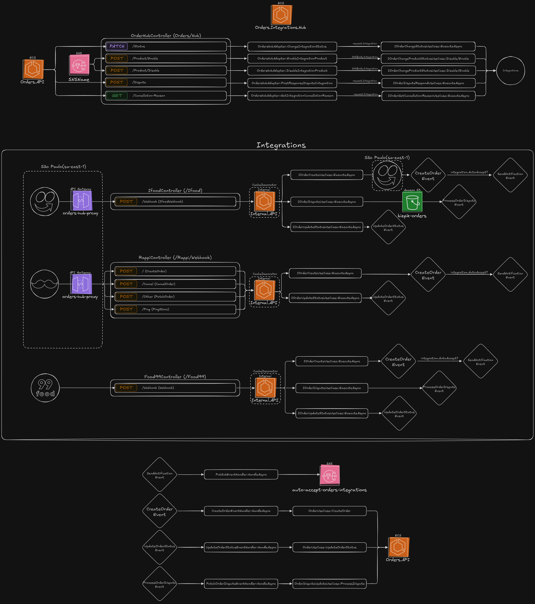

# Integrations Hub for Orders

**`Orders.Integrations.Hub`** is a modular and extensible integration hub built with **.NET 9**, designed to receive and standardize external orders from platforms like iFood, Rappi, and more. It forwards these orders to an internal system using a clean and decoupled architecture.

## 🔗 Summary

 - [🔭 Overview](#-overview)
 - [🧩 Architecture Diagram](#-architecture-diagram)
 - [📁 Project Structure](#-project-structure)
 - [🧱 Integration Architecture](#-integration-architecture)
   - [➕ Adding a New Integration](#-adding-a-new-integration)
 - [🔄 Communication Flow](#-communication-flow)
 - [🧪 Testing](#-testing)
 - [🧪 Observability & Monitoring](#-observability--monitoring)
 - [🧰 Local Development](#-local-development)
   - [🐳 With Docker Compose](#-with-docker-compose)
   - [☁️ Infrastructure](#-infrastructure)
   - [🔧 Configuration](#-configuration)
 - [🔧 Tech Stack](#-tech-stack)
 - [🧠 Future Improvements](#-future-improvements)
 - [🤝 Contributing](#-contributing)
 - [📄 License](#-license)

---

## 🔭 Overview

This project serves as a central entry point for receiving and processing external orders. It provides:

- 🧱 **Based on Hexagonal Architecture (Ports & Adapters)**
- 🌐 **Minimal APIs**
- 📃 **Scalar** (OpenAPI alternative) for documentation
- 🔄 **Event-driven architecture** for internal communication using **FastEndpoints**
- 🔌 **Pluggable integrations** (e.g., Rappi, iFood)
- 📦 **Memory and Distributed Caching**
- 📊 **Observability** with OpenTelemetry
- ☁️ **Infrastructure as Code** with Terraform and LocalStack
- 🧪 **Comprehensive Test Suite**: Unit and Architecture tests

---

## 🧩 Architecture Diagram

> 📌 You can find the diagram in: [`Docs/Architecture.png`](./Docs/Architecture-Light.png)



Key elements:
- Inbound integrations via Webhooks or Pulling
- Each integration (iFood, Rappi, etc.) has isolated flows
- Events are created and consumed asynchronously
- All inbound calls use the `UseCases.In` contracts to reach internal services (e.g., Orders API)
- All outbound calls use the `UseCases.Out` contracts to reach external services (e.g., Orders API)

---

## 📁 Project Structure

```
Orders.Integrations.Hub/
├── Src/
│   └── Orders.Integrations.Hub/
│       ├── Core/
│       │   ├── Adapter/        # HTTP endpoints (Minimal APIs)
│       │   ├── Application/    # Middlewares, Extensions, Use Cases
│       │   └── Domain/         # Contracts, Entities, Value Objects
│       │
│       └── Integrations/       # Modular integrations: Ifood, Rappi, etc.
│           └── Common/         # Common 
│
├── Test/
│   ├── Orders.Integrations.Hub.UnitTests/
│   └── Orders.Integrations.Hub.ArchTests/
│    
├── Infra/
│   └── terraform/              # Infrastructure code using Terraform
│
├── .env.example                # Example of the necessary environment variables
└── docker-compose.yml          # Local dev environment
```

---

## 🧱 Integration Architecture

Each integration is encapsulated in its own folder and follows its own mini-architecture. This makes it easy to add or evolve integrations independently.

### ➕ Adding a New Integration
1. Create a folder under `Integrations/[NewPartner]`
2. Implement the architecture that you prefer
3. Register dependencies in `[Integration]DependencyInjection.cs`

---

## 🔄 Communication Flow

- External platforms (iFood, Rappi, etc.) receive data via webhooks or pulling
- Requests hit the corresponding controller or endpoint (e.g., `IfoodController`)
- Adapter translates the request into internal format
- UseCases send orders via the `UseCases.Out` contracts to the internal Orders system
- Events are dispatched using `Core.Domain.ValueObjects.Events`

---

## 🧪 Testing

- ✅ **Unit Tests** for application logic
- 🧱 **Architecture Tests** using ArchUnit.NET to enforce domain boundaries and modularity

---

## 🧪 Observability & Monitoring

- **OpenTelemetry**: Tracing, logging, and metrics
- **Grafana**: Dashboards to visualize telemetry data
- **Aspire**: For service discovery and metrics aggregation

---

## 🧰 Local Development

### 🐳 With Docker Compose

```bash
docker-compose up --build -d
```

Includes:
- Orders.Integrations.Hub
- Grafana
- Aspire
- LocalStack (mock Cloud)

### ☁️ Infrastructure

Using Terraform to provision LocalStack:

```bash
cd infra/terraform/envs/local
terraform init
terraform apply
```

Provisioned modules:
- API Gateway
- S3

### 🔧 Configuration

To configure the environment, copy the `.env.example` to `.env` file and fill in the required values:

```bash
cp .env.example .env
```

#### 🔑 Environment Variables Overview
| Category   | Variables                                                                          |
|------------|------------------------------------------------------------------------------------|
| Internal   | 	ORDERS__ENDPOINT__BASE_URL — Internal Orders API endpoint                         | 
| IFood	     |  INTEGRATIONS__IFOOD__CLIENT__ID, CLIENT__SECRET, ENDPOINT__BASE_URL, CACHE__KEY   | 
| Rappi	     |  INTEGRATIONS__RAPPI__CLIENT__ID, SECRET, AUDIENCE, ENDPOINT__BASE_URL, etc.       | 
| Cache	     |  MEMCACHED__ADDRESS, MEMCACHED__PORT                                               | 
| Pub/Sub    | 	PUB_SUB__TOPICS__ACCEPT_ORDER, IS_LOCAL                                           | 
| Storage    | 	OBJECT_STORAGE__BUCKET__NAME                                                      | 
| LocalStack | 	LOCALSTACK__AWS__IS_LOCALSTACK, ENDPOINT_URL                                      | 
| AWS        | 	AWS_PROFILE, AWS_REGION                                                           | 
| Telemetry  | 	OTEL_SERVICE_NAME, OTEL_EXPORTER_OTLP_ENDPOINT                                    | 

📁 For local development, most values can be left blank or set to local/test equivalents.

---

## 🔧 Tech Stack

| Layer               | Technology                   |
|---------------------|------------------------------|
| Framework           | .NET 9, Minimal API          |
| Architecture        | Hexagonal (Ports & Adapters) |
| Docs                | Scalar                       |
| Caching             | Memory + Distributed Cache   |
| Events              | FastEndpoints.Events         |
| Tracing/Telemetry   | OpenTelemetry                |
| Monitoring          | Grafana, Aspire              |
| Infra as Code       | Terraform + LocalStack       |
| Containers          | Docker Compose               |
| Testing             | xUnit, ArchUnit.NET          |

---

## 🧠 Future Improvements

- Implement Architecture testing for the Core
- Implement Architecture testing for each integration
- Create Unit testing
- Create Integration tests
- Add queue-based backpressure handling
- Integration SDK Generator from Core contracts

---

## 🤝 Contributing

Pull requests are welcome! For major changes, please open an issue first to discuss what you would like to change.

---

## 📄 License

[MIT](LICENSE)